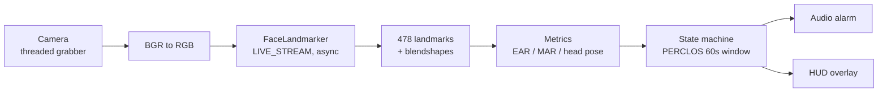

# Driver Monitoring System (DMS)

[](https://www.python.org/downloads/release/python-3110/)
[](https://opencv.org/)
[](https://ai.google.dev/edge/mediapipe/solutions/vision/face_landmarker)
[](LICENSE)
[](https://github.com/aghemanthgowda/dms/actions/workflows/tests.yml)
[](https://github.com/aghemanthgowda/dms/stargazers)
[](https://github.com/aghemanthgowda/dms/commits)

A real-time **driver drowsiness and distraction monitor**. A webcam feed is run
through Google's current [MediaPipe Tasks
`FaceLandmarker`](https://ai.google.dev/edge/mediapipe/solutions/vision/face_landmarker)
(478-point mesh + blendshapes), from which the system derives eye/mouth openness,
head pose, and a rolling PERCLOS drowsiness estimate — sounding an alarm when the
driver appears to be falling asleep or looking away from the road.

## What this does

- **Eye closure** via the Eye Aspect Ratio (EAR), cross-checked against
  MediaPipe's `eyeBlink` blendshape scores.
- **Yawning** via the Mouth Aspect Ratio (MAR).
- **Drowsiness** via **PERCLOS** — the percentage of eye closure over a rolling
  **60-second** window — driving a small state machine rather than a naive frame
  counter.
- **Distraction** via head pose (`cv2.solvePnP` yaw/pitch/roll), flagged on
  sustained yaw beyond 30°.
- **Calibration** mode that samples the driver's baseline EAR for 5 seconds at
  startup and sets thresholds relative to that baseline.
- **Audio alarm** (`pygame.mixer`) plus an on-frame HUD showing FPS, EAR, MAR,
  PERCLOS, head pose, and the current state.

## Pipeline



The landmarker runs in `RunningMode.LIVE_STREAM`: frames are submitted
asynchronously and results arrive on a callback, so camera I/O, inference, and
rendering never block one another.

## Install

Requires **Python 3.11**.

```bash
git clone https://github.com/aghemanthgowda/dms.git
cd dms
python -m venv .venv && source .venv/bin/activate
pip install -r requirements.txt

# Download the face_landmarker_v2 .task bundle into models/ (gitignored)
python scripts/download_model.py
```

Optionally drop a short `.wav` at `assets/alarm.wav` for the audible alarm; if it
is missing the system runs silently.

## Usage

```bash
python main.py                 # default camera (index 0)
python main.py --camera 1      # pick a specific camera
python main.py --calibrate     # sample a 5s baseline EAR at startup
python main.py --no-audio      # visual-only, no alarm
```

Press **`q`** to quit.

## Metrics explained

| Metric | Definition | Signal |
| --- | --- | --- |
| **EAR** | `(‖p2−p6‖ + ‖p3−p5‖) / (2·‖p1−p4‖)` over the 6 eye landmarks | Drops toward 0 as the eye closes |
| **MAR** | Same ratio applied to 6 mouth landmarks | Rises during a yawn |
| **Blendshapes** | MediaPipe `eyeBlinkLeft/Right`, `jawOpen` scores | Model-based cross-check for EAR/MAR |
| **PERCLOS** | Fraction of the last 60s the eyes were closed | Primary drowsiness indicator |
| **Head pose** | Yaw/pitch/roll from `solvePnP` on a generic 3D face model | Sustained yaw > 30° ⇒ distraction |

EAR/MAR are cheap and robust; blendshapes provide an independent, learned
cross-check; PERCLOS integrates over time to distinguish a blink from genuine
drowsiness; head pose catches "eyes off road" that eye-openness alone misses.

## Limitations

This is a driver-assistance aid, **not** a safety-certified system. Known
failure modes:

- **Darkness / low light.** The RGB landmarker degrades sharply at night or in
  tunnels; landmark confidence drops and EAR becomes unreliable. A real vehicle
  DMS uses a near-infrared camera and IR illuminator — see the *Add IR camera
  support* issue.
- **Sunglasses.** Tinted or reflective lenses hide the eyes, breaking EAR and the
  eye-blink blendshapes entirely. The system cannot detect drowsiness from the
  eyes in this case and falls back to yawn/head-pose cues only.
- **Extreme head rotation.** Beyond roughly ±45° yaw the eye landmarks become
  self-occluded and both EAR and `solvePnP` lose accuracy; readings in that range
  should be treated as low-confidence.
- Other caveats: heavy occlusion (hands, masks), very fast head motion, multiple
  faces in frame, and unusual camera placement all reduce accuracy.

## Development

```bash
pip install pytest
pytest -v
```

The metrics are pure NumPy and fully unit-tested with synthetic landmarks, so the
test suite runs without a camera, MediaPipe, or a display — which is exactly what
the CI badge above verifies on every push.

## License

[MIT](LICENSE) © Hemanth Gowda A G
